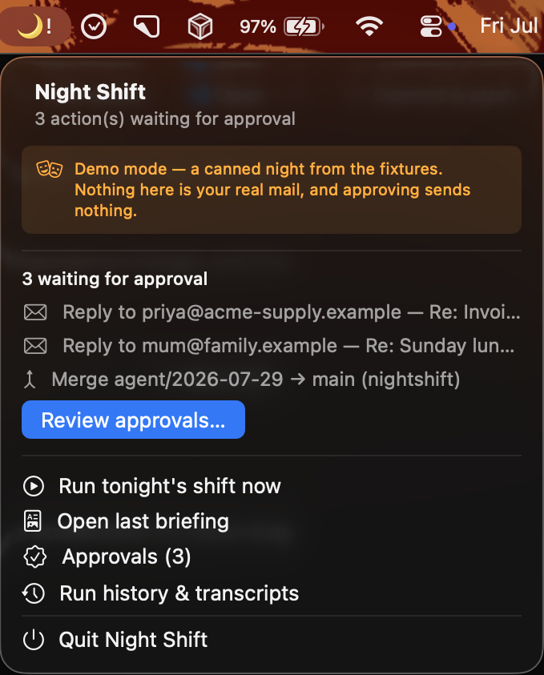

# NightShift

**An overnight agent for macOS.** While you sleep it triages your email, plans your day
from your calendar and tasks, and does real coding work on your projects in a sandboxed
Linux container. In the morning you get one HTML briefing, a reviewable git branch per
project, and a queue of proposed actions, draft replies, branch merges, all that do nothing until you approve them.

## Demo

**[Watch the demo (1 min)](docs/nightshift-demo.mp4)** — the app running in demo mode, from
the .dmg to approving an action.



*The menu bar panel on a first launch: three proposed actions waiting, and a banner saying
this is the canned night — approving here sends nothing.*

A morning briefing in full, if you want to read one rather than watch it:
[the inbox and the day](docs/briefing.png) (email triaged by urgency, with an email that
tried to hijack the agent reading it summarised as what it is), and
[last night's project work](docs/briefing-projects.png).

---

## Try it without setting anything up

Download the .dmg from the [latest release](../../releases/latest), drag NightShift.app to
Applications, then **right-click it and choose Open** the first time (the app is ad-hoc
signed, not notarised, so a double-click shows a scary error instead of an Open button).

A moon appears in the menu bar. With no NightShift daemon running, the app starts in **demo
mode**: it launches the copy of the daemon inside its own bundle, serving one canned night
built from the repo's test fixtures.

Running it *for real* is the rest of this README.

## Setup from scratch

Roughly 20 minutes, most of it Google's consent screen. Every step is required for a real
run; you can stop after step 4 and rehearse the whole thing offline.

### 1. Prerequisites

```sh
brew install colima docker            # the sandbox runtime
brew install uv                       # or: curl -LsSf https://astral.sh/uv/install.sh | sh
brew install terminal-notifier        # optional: click-through wake-up notifications
```

You need **Python 3.13+**; `uv` fetches it for you. macOS 13+ with a Keychain (the OAuth
tokens live there) and Docker via colima — the orchestrator starts the VM on first run,
which takes a minute.

```sh
git clone <this repo> && cd NightShift
uv sync                 # runtime deps
uv sync --group app     # + rumps, for the menu bar (host-only, macOS-only)
```

### 2. A Google OAuth client

NightShift talks to your Gmail, Calendar and Tasks as *you*, through an OAuth client you
own. There is no NightShift server and no shared app.

1. Go to the [Google Cloud Console](https://console.cloud.google.com/) → **create a
   project** (any name).
2. **APIs & Services → Library** → enable **Gmail API**, **Google Calendar API** and
   **Google Tasks API**.
3. **APIs & Services → OAuth consent screen** → User type **External** → fill in the app
   name and your own email. While the app is in *Testing*, add your Google account under
   **Test users** — otherwise consent fails.
4. **APIs & Services → Credentials → Create credentials → OAuth client ID** → application
   type **Desktop app**. (Desktop, not Web: the flow runs a loopback listener on
   `localhost:8765`.)
5. Copy the client ID and secret into a `.env` file in the repo root:

```sh
# .env — never commit this file (it is in .gitignore)
GOOGLE_CLIENT_ID=xxxxxxxx.apps.googleusercontent.com
GOOGLE_CLIENT_SECRET=xxxxxxxx
OPENROUTER_API_KEY=sk-...                       # your LLM key (see step 3)
OPENROUTER_BASE_URL=https://ai.hackclub.com/proxy/v1   # optional; config wins over this
```

**The scopes NightShift asks for**, split across two independently-authorised credential
slots that are never merged:

| Slot | Scopes | Who uses it |
|---|---|---|
| `read` (`google-oauth:read`) | `gmail.readonly`, `calendar.readonly`, **optional** `tasks.readonly` | the broker, which is the only surface the sandbox can reach |
| `send` (`google-oauth:send`) | `gmail.send` | the host only, reached exclusively from an approved action |

Consent for each slot happens the first time it is used, or on demand:

```sh
uv run python google_auth.py authorise read    # opens a browser; tick Google Tasks too
uv run python google_auth.py authorise send
uv run python google_auth.py status read       # what the stored token actually grants
uv run python google_auth.py forget read       # drop it; the next use re-authorises
```

Tokens are stored in the **macOS Keychain** (service `NightShift`), never in a file. If you
decline the Tasks tickbox, the briefing says "Tasks unavailable" and the night still runs.

### 3. An LLM key

Any OpenAI-compatible endpoint works; the model slugs live in the config file and the key
lives in `.env`. Set `[llm].base_url` in `config/standing_instructions.toml` to your
provider and put the key in `OPENROUTER_API_KEY`. **Read
[The provider-side hard cap](#the-provider-side-hard-cap-you-must-do-this-yourself) before
pointing this at a card you own** — the in-repo budgets are the first line of defence, not
the last.

### 4. Your standing instructions

`config/standing_instructions.toml` is the one file you hand-edit. It carries your
priorities, writing style, per-agent model slugs and budgets, the schedule, retention, and
the projects the agent may work on. It is trusted host-authored data and is committed to
the repo, so **never put a secret in it** — the loader rejects unknown keys, so a typo is
loud rather than silent.

Rehearse the whole pipeline offline, against canned data, with no Google and no network:

```sh
uv run python main.py --mock --no-send --open       # → out/briefing.html in your browser
uv run python -m orchestrator run --mock --no-send --now --no-require-ac
```

### 5. Your first real run

```sh
uv run python api.py &                 # the broker on localhost:8400
curl -s "localhost:8400/emails?since=8h" | jq .
uv run python main.py                  # fetch → digest → email it to yourself
```

Then the full night, once, by hand:

```sh
uv run python -m orchestrator run --now
open out/briefing.html
```

### 6. Turn on the schedule and the menu bar

```sh
uv run python -m orchestrator schedule install    # see "Running it nightly" below
uv run python -m app                              # 🌙 in the menu bar
```


## AI disclosure

AI coding assistance was used during implementation, debugging and build verification. Product direction and final acceptance remained with me.
